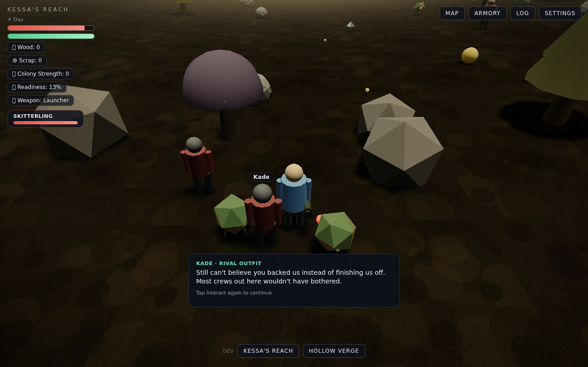
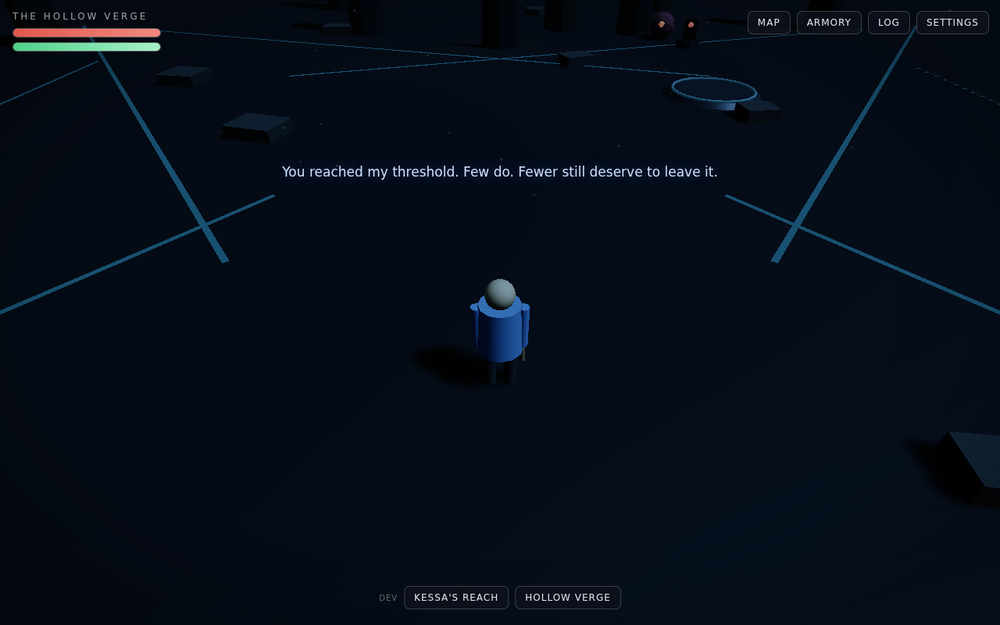

# Beyond the Hollow

A browser-based narrative sci-fi survival game built with Three.js — a single, self-contained HTML file, no build step, no install.

Your expedition ship crash-lands on a hostile frontier world. Survive, build a colony with your crew, and make the decisions that define you — because something ancient is watching, and when you're ready, it will summon you to a place where those decisions echo back.

| Kessa's Reach | The Hollow Verge |
|---|---|
|  |  |

## Play

1. Download (or clone) this repository.
2. Open `beyond_the_hollow.html` in any modern browser.

That's it. An internet connection is needed on first load (Three.js comes from a CDN). Saves persist for the current session; a full playthrough takes roughly 30–45 minutes.

## Controls

| Action | Keys |
|---|---|
| Move | `WASD` or arrow keys |
| Look / turn | drag the mouse |
| Sprint | `Shift` |
| Jump | `Space` |
| Interact / talk / gather / build | `E` |
| Attack | `F` |
| Heavy strike (2.2× damage, wide arc) | `G` |
| Spin attack (hits all around you) | `Q` |
| Ship flight | `WASD` pitch/yaw · `Q/E` roll · `Space`/`Shift` throttle · `F` fire |

Stay clear of hostiles for ~35 seconds and your health regenerates on its own (the HP bar glows green while it does). All keys are remappable in **Settings**, which also has difficulty, colorblind mode, graphics quality, text size, and subtitles. A control reference sits at the bottom of the screen, and the game offers gentle hints if you're stuck.

## The game

- **Act 1 — Kessa's Reach.** Explore, fight wildlife, gather wood and scrap, and build your colony. Three major decisions land here: a rival faction at the ridge, your pilot's secret, and your scientist's discovery. Raise **Readiness** (combat + exploration + colony) to 100%.
- **The Summon.** At full Readiness, the game's second world opens — seamlessly, no reload.
- **Act 2 — The Hollow Verge.** An ancient ring-world whose custodian AI, Ashketh, tests you with three trials: Strength, Restraint, and Cooperation.
- **The ending** takes one of four tones, shaped by the three decisions you made back on Kessa's Reach.

## Repository layout

| Path | What it is |
|---|---|
| `beyond_the_hollow.html` | **The game.** One self-contained file: engine, both worlds, story, UI. |
| `world_prototype.html` | Original Planet A prototype (pre-merge, kept for reference). |
| `planet_b_prototype.html` | Original Planet B prototype (pre-merge, kept for reference). |
| `reference/` | Design bibles, the merge specification, and project docs. |
| `screenshots/` | Images used in this README. |

The two prototypes were merged into the unified game following `reference/beyond_the_hollow_merge_spec.md`; the git history walks through that merge phase by phase.

## Tech notes

- Three.js **r128** (global CDN build — note: no `CapsuleGeometry` in r128).
- Single `Engine.*` core (renderer, input, audio, rig, combat, settings, save) with each world as a plug-in module behind a small `WorldManager` interface.
- Procedural everything: terrain textures, audio (Web Audio oscillators/noise), particles.
- Ambient NPC dialogue can be enriched by a live LLM call when hosted in an environment that proxies the Anthropic API; everywhere else it falls back silently to hand-written lines.

## Contributing

Contributions are welcome — see [CONTRIBUTING.md](CONTRIBUTING.md) to get started.

## License

[MIT](LICENSE)
